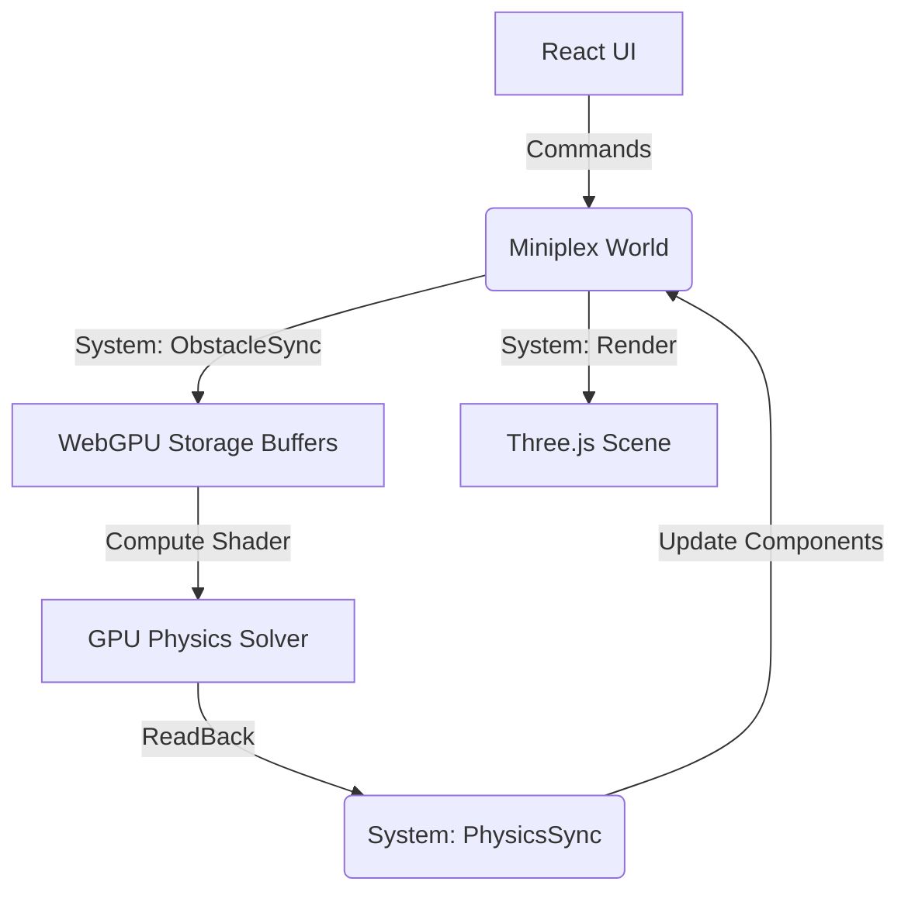

# Web-Builder 2D Architecture

## 1. Technical Stack
- **Renderer:** Three.js `WebGPURenderer` (rendering and GPU state management).
- **Physics Engine:** Custom WebGPU Compute Shaders based on **Position Based Dynamics (PBD)**.
- **State Management (ECS):** `miniplex` for entity management, level structure, and CPU-side logic.
- **Editor Engine:** Gizmo and Tool management via React + ECS interactions.
- **Frontend:** React for the Editor UI and tool management.

## 2. Core Architectural Pillars

### A. The GPU / ECS Hybrid Flow
1. **React UI:** User selects tools (Build, Create, Edit).
2. **Miniplex World:** Interactions create or modify **Entities**. 
   - *Example Entity:* `{ transform, sdfCollider, renderable }`.
3. **Sync Systems:** 
   - **Static Sync:** Updates GPU `Obstacles` with Transform matrices and SDF params.
   - **Dynamic Sync:** Reads back particle positions; updates ECS `Transform` and UI `Object List`.
   - **Property Sync:** UI edits directly modify ECS components, triggering buffer updates.
4. **Solver:** The Compute Shader runs PBD iterations (Integrate -> Solve Constraints -> Solve Collisions).

### B. Collision & Shapes
- **Analytical SDFs:** Initial support for Circles and Boxes (fast, exact).
- **Particle Clusters:** Complex dynamic objects are built from groups of particles held together by rigid distance/angle constraints.
- **Texture SDFs (Planned):** For static level geometry, allowing complex hand-drawn environments processed via distance field textures.

### C. Friction & Materials
- **PBD Friction:** Implemented by projecting `oldPos` toward the current `pos` along the collision tangent, effectively reducing velocity components parallel to surfaces.
- **Material Properties:** Entities will hold `friction`, `elasticity`, and `mass` components, which are packed into GPU buffers per-object.

### D. Constraints & Motors
- **Constraints:** Distance (ropes/stiffness), Angle (bending/rigidity), and Weld (rigid attachments).
- **Motors:** 
  - **Motor Pins:** A special constraint type that applies a target angular velocity to a particle cluster relative to a pivot.
  - **Linear Motors:** Adjustable `rest_length` over time (used in the rope spooling logic).

## 3. Communication Diagram

## 4. Remaining Considerations / To-Do
- **Spatial Partitioning:** Implementation of a Spatial Hash Grid on GPU if static complexity exceeds analytical limits.
- **Level Serialization:** Standardizing the JSON schema for ECS entity export/import.
- **Substepping Optimization:** Balancing GPU iterations vs. CPU readback latency for maximum stability.